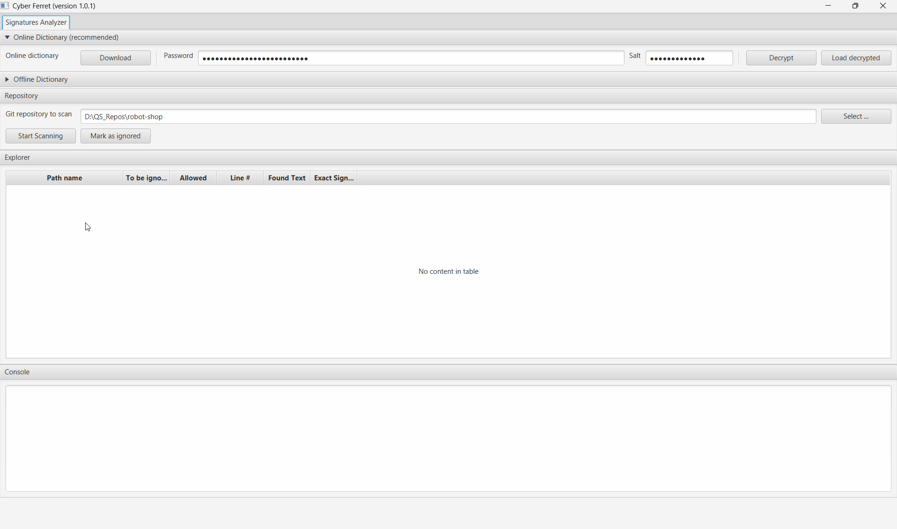

# Cyber Ferret
[]()

Scans any files for different pre-defined signatures (supporting RegExp and other rules)

# Example
[]()

# How to build from sources via command line
## Prerequisites
* Install JDK (24 or newer) from https://jdk.java.net/24/
* Install JavaFX (24 or newer) from https://gluonhq.com/products/javafx/
* Install Apache Maven (ver 3.9.x) from https://maven.apache.org/download.cgi
* Setup M2_HOME, JAVA_HOME and PATH (add maven and java) System Variables as recommended for Java and Maven usage
* Optional = setup JAVAFX_PATH System Variable for handy run of the application using predefined shell-scripts in ./src/shell/*.* 

## Compilation & build
Navigate to the CyberFerret folder where ./pom.xml presents and run:
```shell
mvn clean package assembly:single
```

Find built ".\target\cyberferret.jar" file which is 17+MiB of size. Use it as a single pack of whole application. 

# How to run - Windows version
Replace "${PATH_TO_JAVA_FX_SDK}" with correct path to JavaFx SDK
```shell
java --module-path "${PATH_TO_JAVA_FX_SDK}\lib" --add-modules javafx.controls,javafx.web,javafx.graphics --enable-native-access=javafx.graphics -jar cyberferret.jar
```
or use ./src/shell/run-app.cmd file

# How to run - Linux/macOS version
Replace "$path_to_javafx_sdk" with correct path to JavaFx SDK
```shell
java --module-path $path_to_javafx_sdk/lib --add-modules javafx.controls,javafx.web,javafx.graphics --enable-native-access=javafx.graphics -jar ./target/cyber-ferret.jar
```
or use ./src/shell/run-app.sh file

# How to run - in IntelliJ IDEA
## prerequisites
Install JDK from https://jdk.java.net/24/
Install JavaFX from https://gluonhq.com/products/javafx/
Create Run/Debug Configuration Profile of type "Application"
Set VM options "--module-path "...\JDKs\javafx-sdk-24.0.1\lib" --add-modules  javafx.controls,javafx.web,javafx.graphics --enable-native-access=javafx.graphics"


# Dictionary format
## Dictionary example file
```properties
# It is just a java properties file with a key=value pairs per line
# Reserved key 'VERSION' is used for users notifications only, may be skipped
VERSION=1.1

# All key names may be in 3 formats
# KEY_NAME=VALUE - means the ferret will search for VALUE-string case-insensitive, the VALUE-string will be converted to RegExp pattern '\bVALUE\b'. Note: all spaces inside will be replaced with '\\s+', all special chars (&, -, +) will be escaped by '\\'
# KEY_NAME(regexp)=VALUE - means you have finally defined RegExp pattern, and it will be used as is
# KEY_NAME(allowed)=VALUE - means you have defined exact string - which may be found during scanned, but must be treated as allowed. Actually no matter what key name will be used - the value is a global string.
# KEY_NAME(exclude-ext)=VALUE1,VALUE2,etc.. - list of file extentions to be ignored for the "KEY_NAME" signature
# Notes: all key names must be unique

Examples
SUB-DOMAIN(regexp)=\\w+\\.example-domain\\.com
SUB-DOMAIN-1(allowed)=test1.example-domain.com
SUB-DOMAIN-2(allowed)=test2.example-domain.com

# Emails
EMAIL(regexp)=([a-zA-Z0-9._-]+@[a-zA-Z]+\\.(?:com|ru|net|org|edu|gov|mil|int|us|uk|de|jp|in|test|localhost|invalid|example|arab|cn|ua)+)
EMAIL-1(allowed)=example@example.com
EMAIL-2(allowed)=test@mail.org
EMAIL-3(allowed)=admin@domain.net
EMAIL(exclude-ext)=exe,bin,ttf,zip

# Passwords or credentials
PASSW-001=password
PASSW-002=1234567890
PASSW-003=qwerty123

# IP Address
IP-ADDR(regexp)=((25[0-5]|2[0-4][0-9]|[01]?[0-9][0-9]?)\\.){3}(25[0-5]|2[0-4][0-9]|[01]?[0-9][0-9]?)
IP-ADDR-1(allowed)=0.0.0.0
IP-ADDR-2(allowed)=127.0.0.1
```
