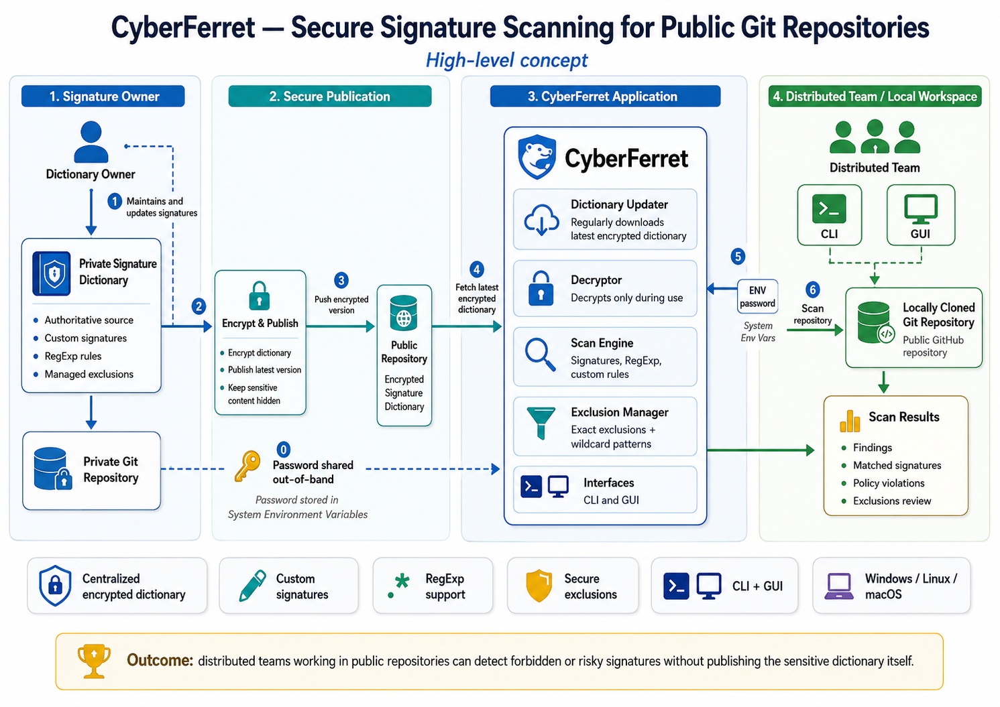
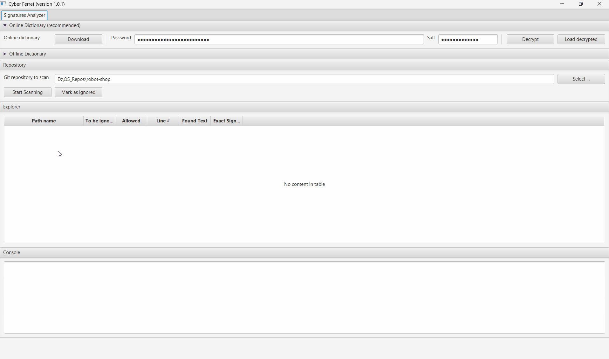

# Cyber Ferret, v2.x.x
[]()

Scans locally cloned Git-repository for different pre-defined signatures (supporting RegExp and other rules).
The main difference to other popular opensource similar scanners are:
* Ability to have centralized signatures dictionary
* Dictionary is published in encrypted state and ecrypted during use
* Both interfaces are supported: CLI & GUI
* Ability to manage exclusions per exact signature and file in secured manner

Other base features are supported:
* Ability to customize signatures to be found
* Ability to define signatures using RegExp
* Ability to define exclusions including wild-card expressions
* Windows, Linux, MacOS is supported


# High level usage flow
[]()

# Roles
* Signatures dictionary owner - manages signatures dictionary and encrypts it with special password. It allows to publish/transfer dictionary over public network and service.
* Team - uses CyberFerret and signatures dictionary. They also know special password but they don't care about dictionary transportation and update procedure.

# Pre-requisites
* Install [JDK 21 or newer](https://jdk.java.net/21/)
* Install [JavaFX 21 or newer](https://gluonhq.com/products/javafx/)
* Install Apache Maven (ver 3.9.x) from https://maven.apache.org/download.cgi
* Install [Git](https://git-scm.com/downloads) and ensure `git` is available on `PATH`
* Setup M2_HOME, JAVA_HOME and PATH (add maven and java) System Variables as recommended for Java and Maven usage

Note, that CyberFerret CLI calls git to understand list of files to be ignored during scan.

# Scanning procedure
CyberFerret scans tracked files and untracked files that Git does not ignore. This includes newly created source files that have not been added to Git yet.

Cyber Ferret skips files excluded by standard Git rules, including repository `.gitignore` files,
`.git/info/exclude`, and the user's global Git excludes file. Git must be available on `PATH` to scan a Git
repository. When you scan a directory that is not a Git repository, Cyber Ferret scans regular files without following
symbolic links to directories or entering `.git` directories.

Checked-out Git submodules are scanned recursively. Cyber Ferret does not follow symbolic links to directories, so a
tracked link cannot make a scan traverse an external repository. Symbolic links to regular files remain scannable.
On Unix systems, the scanner also preserves and scans file names that contain byte sequences that are not valid UTF-8.

# Example
[]()

# How to build from sources via command line

## Compilation & build
WARN: to be updated!

Navigate to the CyberFerret folder where ./pom.xml presents and run:
```shell
mvn clean package assembly:single
```

After build you will get module-specific JARs under `fx/target` and `cli/target`.

Build only CLI:
```shell
mvn -pl cli -am clean package assembly:single
```

Build only JavaFX:
```shell
mvn -pl fx -am clean package assembly:single
```

After modularization, build artifacts are:
* JavaFX app: `.\fx\target\cyberferret-fx.jar`
* CLI app: `.\cli\target\cyberferret-cli.jar`

# How to run - Windows version
Replace "${PATH_TO_JAVA_FX_SDK}" with correct path to JavaFx SDK
```shell
java --module-path "${PATH_TO_JAVA_FX_SDK}\lib" --add-modules javafx.controls,javafx.web,javafx.graphics --enable-native-access=javafx.graphics -jar .\fx\target\cyberferret-fx.jar
```
or use ./fx/src/shell/run-app.cmd file

# How to run - Linux/macOS version
Replace "$path_to_javafx_sdk" with correct path to JavaFx SDK
```shell
java --module-path $path_to_javafx_sdk/lib --add-modules javafx.controls,javafx.web,javafx.graphics --enable-native-access=javafx.graphics -jar ./fx/target/cyberferret-fx.jar
```
or use ./fx/src/shell/run-app.sh file

# How to run - in IntelliJ IDEA
## prerequisites
Install [JDK 21 or newer](https://jdk.java.net/21/)
Install [JavaFX 21 or newer](https://gluonhq.com/products/javafx/)
Create Run/Debug Configuration Profile of type "Application"
Set VM options:

```shell
--module-path "...\JDKs\javafx-sdk-21\lib" --add-modules javafx.controls,javafx.web,javafx.graphics --enable-native-access=javafx.graphics
```


# Dictionary format
## Dictionary example file
```properties
# It is just a java properties file with a key=value pairs per line
# Reserved key 'VERSION' is used for users notifications only, may be skipped
VERSION=1.1

# All key names may be in 3 formats
# KEY_NAME=VALUE - means the ferret will search for VALUE-string case-insensitive, the VALUE-string will be converted to RegExp pattern '\bVALUE\b'. Note: all spaces inside will be replaced with '\\s+', all special chars (&, -, +) will be escaped by '\\'
# KEY_NAME(regexp)=VALUE - means you have finally defined RegExp pattern, and it will be used as is
# KEY_NAME(allowed)=VALUE - means you have defined an exact string or a value with '*' wildcards that may be found during scanning, but must be treated as allowed. Each '*' matches one or more nonwhitespace characters. Actually no matter what key name will be used - the value is a global string.
# KEY_NAME(exclude-ext)=VALUE1,VALUE2,etc.. - list of file extentions to be ignored for the "KEY_NAME" signature
# Notes: all key names must be unique

Examples
SUB-DOMAIN(regexp)=\\w+\\.example-domain\\.com
SUB-DOMAIN-1(allowed)=test1.example-domain.com
SUB-DOMAIN-2(allowed)=test2.example-domain.com

# Emails
EMAIL(regexp)=([a-zA-Z0-9._-]+@[a-zA-Z]+\\.(?:com|ru|net|org|edu|gov|mil|int|us|uk|de|jp|in|test|localhost|invalid|example|arab|cn|ua)+)
EMAIL-1(allowed)=example@example.com
EMAIL-2(allowed)=test@mail.org
EMAIL-3(allowed)=*@example.com
EMAIL(exclude-ext)=exe,bin,ttf,zip

# Passwords or credentials
PASSW-001=password
PASSW-002=1234567890
PASSW-003=qwerty123

# IP Address
IP-ADDR(regexp)=((25[0-5]|2[0-4][0-9]|[01]?[0-9][0-9]?)\\.){3}(25[0-5]|2[0-4][0-9]|[01]?[0-9][0-9]?)
IP-ADDR-1(allowed)=0.0.0.0
IP-ADDR-2(allowed)=127.0.0.1
```
